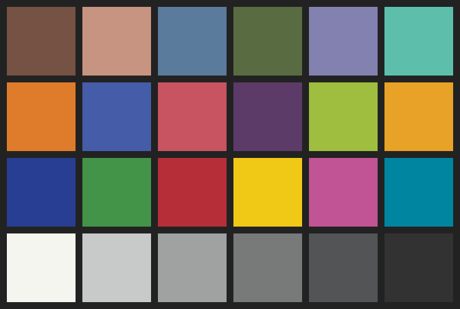

# PNG tests of cICP chunk

## How to run the tests

todo

## Detailed test explanation

The starting point is the same [sRGB Macbeth Color Checker](https://github.com/svgeesus/PNG-ICC-tests/blob/main/README.md) from the [PNG ICC tests](https://github.com/svgeesus/PNG-ICC-tests/tree/main).

The sRGB values below are rounded to 8-bit (0 to 255) precision and given as decimal values.

<table>
<tr>
<td>dark skin rgb(117 82 67)</td>
<td>light skin rgb(199 148 129)</td>
<td>blue sky rgb(91 123 157)</td>
<td>foliage rgb(89 108 65)</td>
<td>blue flower rgb(131 129 176)</td>
<td>bluish green rgb(94 190 172)</td>
</tr>
<tr>
<td>orange rgb(223 124 44)</td>
<td>purplish blue rgb(69 92 168)</td>
<td>moderate red rgb(200 84 97)</td>
<td>purple rgb(92 59 104)</td>
<td>yellow green rgb(159 189 63)</td>
<td>orange yellow rgb(231 162 39)</td>
</tr>
<tr>
<td>blue rgb(39 62 147)</td>
<td>green rgb(67 148 73)</td>
<td>red rgb(182 46 56)</td>
<td>yellow rgb(240 200 22)</td>
<td>magenta rgb(193 84 149)</td>
<td>desat_cyan rgb(0 133 160)</td>
</tr>
<tr>
<td>white 9.5 rgb(245 245 240)</td>
<td>neutral 8 rgb(200 201 201)</td>
<td>neutral 6.5 rgb(160 161 161)</td>
<td>neutral 5 rgb(120 121 121)</td>
<td>neutral 3.5 rgb(83 84 85)</td>
<td>black 2 rgb(50 50 50)</td>
</tr>
</table>

The patch values are then converted to each tested CICP-labelled color space
using [color.js](https://colorjs.io/) (see [workings](workings/README.md)),
and are used to generate a PNG image to which the appropriate `cICP` chunk is added.

For each test, the test image is loaded into an sRGB canvas 2D context,
causing colorspace conversion. The resulting sRGB values are then read back and compared with the original sRGB values.