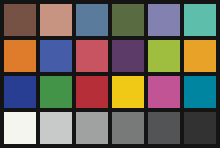
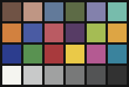
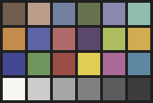

# Colorspace conversions

### Display p3

Converted [from sRGB](../README.md) to display p3 [using color.js](https://colorjs.io/apps/convert/?color=rgb(199%20148%20129)&precision=5) and coordinates rounded to [0,255].

<table>
<tr>
<td>dark skin<br>color(display-p3 0.43827 0.32728 0.27227)<br>[112, 83, 69]</td>
<td>light skin<br>color(display-p3 0.74986 0.58848 0.518)<br>[191, 150, 132]</td>
<td>blue sky<br>color(display-p3 0.38292 0.47883 0.6039)<br>[98, 122, 154]</td>
<td>foliage<br>color(display-p3 0.36363 0.42131 0.27327)<br>[93, 107, 70]</td>
<td>blue flower</br>color(display-p3 0.51234 0.50615 0.67637)<br>[131, 129, 172]</td>
<td>bluish green<br>color(display-p3 0.46549 0.73637 0.67618)<br>[119, 188, 172]</td>
</tr>
<tr>
<td>orange<br>color(display-p3 0.82251 0.50571 0.24813)<br>[210, 129, 63]</td>
<td>purplish blue<br>color(display-p3 0.28908 0.35822 0.63846)<br>[74, 91, 163]</td>
<td>moderate red<br>color(display-p3 0.72925 0.3573 0.38876)<br>[186, 91, 99]</td>
<td>purple<br>color(display-p3 0.34201 0.23703 0.39738)<br>[87, 60, 101]</td>
<td>yellow green</br>color(display-p3 0.64646 0.73766 0.32827)<br>[165, 188, 84]</td>
<td>orange yellow<br>color(display-p3 0.86577 0.64673 0.26777)<br>[221, 165, 68]</td>
</tr>
<tr>
<td>blue<br>color(display-p3 0.17274 0.24074 0.55592)<br>[44, 61, 142]</td>
<td>green<br>color(display-p3 0.34706 0.57321 0.31911)<br>[89, 146, 81]</td>
<td>red<br>color(display-p3 0.65731 0.22642 0.2374)<br>[168, 58, 61]</td>
<td>yellow<br>color(display-p3 0.91588 0.79019 0.28062)<br>[234, 201, 72]</td>
<td>magenta</br>color(display-p3 0.70444 0.35488 0.57413)<br>[180, 90, 146]</td>
<td>desat_cyan<br>color(display-p3 0.22558 0.51352 0.6156)<br>[58, 131, 157]</td>
</tr>
<tr>
<td>white 9.5<br>color(display-p3 0.96078 0.96078 0.94295)<br>[245, 245, 240]</td>
<td>neutral 8<br>color(display-p3 0.78501 0.78811 0.78817)<br>[200, 201, 201]</td>
<td>neutral 6.5<br>color(display-p3 0.62815 0.63124 0.63131)<br>[160, 161, 161]</td>
<td>neutral 5<br>color(display-p3 0.47129 0.47438 0.47444)<br>[120, 121, 121]</td>
<td>neutral 3.5<br>color(display-p3 0.32619 0.32928 0.33292)<br>[83, 84, 85]</td>
<td>black 2<br>color(display-p3 0.19608 0.19608 0.19608)<br>[50, 50, 50]</td>
</tr>
</table>

### BT.2020

Converted using color.js; quantization to 10,12 or 16 bit integer values is handled by the converter.

<table>
<tr>
<td>dark skin<br>color(rec2020 0.44316 0.367539 0.310977)</td>
<td>light skin<br>color(rec2020 0.727066 0.617365 0.544058)</td>
<td>blue sky<br>color(rec2020 0.447863 0.504076 0.62293)</td>
<td>foliage<br>color(rec2020 0.405127 0.447781 0.314302)</td>
<td>blue flower</br>color(rec2020 0.54548 0.53461 0.691007)</td>
<td>bluish green<br>color(rec2020 0.568323 0.740283 0.694322)</td>
</tr>
<tr>
<td>orange<br>color(rec2020 0.767823 0.548508 0.292659)</td>
<td>purplish blue<br>color(rec2020 0.365879 0.394032 0.65414)</td>
<td>moderate red<br>color(rec2020 0.680321 0.417335 0.419505)</td>
<td>purple<br>color(rec2020 0.36246 0.285054 0.426803)</td>
<td>yellow green</br>color(rec2020 0.673482 0.744424 0.374998)</td>
<td>orange yellow<br>color(rec2020 0.820068 0.673801 0.316171)</td>
</tr>
<tr>
<td>blue<br>color(rec2020 0.26485 0.28464 0.575819)</td>
<td>green<br>color(rec2020 0.434971 0.585686 0.360921)</td>
<td>red<br>color(rec2020 0.609044 0.305093 0.275929)</td>
<td>yellow<br>color(rec2020 0.880715 0.80344 0.334695)</td>
<td>magenta</br>color(rec2020 0.665847 0.415908 0.593338)</td>
<td>desat_cyan<br>color(rec2020 0.370806 0.53179 0.634393)</td>
</tr>
<tr>
<td>white 9.5<br>color(rec2020 0.962034 0.96262 0.946207)</td>
<td>neutral 8<br>color(rec2020 0.796946 0.799019 0.799214)</td>
<td>neutral 6.5<br>color(rec2020 0.648261 0.650334 0.650529)</td>
<td>neutral 5<br>color(rec2020 0.499577 0.501649 0.501844)</td>
<td>neutral 3.5<br>color(rec2020 0.362209 0.364159 0.367643)</td>
<td>black 2<br>color(rec2020 0.237989 0.237989 0.237989)</td>
</tr>
</table>

## Making the images

A quick and dirty [C program](./macbeth.c) loops over the patch color data
(from either [srgb.h](./srgb.h) or [display-p3.h](display-p3.h))
and spits out an [ascii PPM file](https://netpbm.sourceforge.net/doc/ppm.html).

This is then converted to PNG with
[pnmtopng](https://netpbm.sourceforge.net/doc/pnmtopng.html):

```bash
pnmtopng -verbose tmp.ppm > tmp.png
```

### sRGB 8-bit

There are three versions of the sRGB image -
the image data is the same, only the tagging differs.

The first, `macbeth-untagged-srgb.png`, has no colorspace tagging at all.
CSS Color 4 [says](https://drafts.csswg.org/css-color-4/#untagged) that
untagged images must be treated as being sRGB.



```bash
File: macbeth-untagged-srgb.png (400 bytes)
  chunk IHDR at offset 0x0000c, length 13
    220 x 148 image, 8-bit palette, non-interlaced
  chunk PLTE at offset 0x00025, length 75: 25 palette entries
  chunk IDAT at offset 0x0007c, length 256
    zlib: deflated, 32K window, default compression
  chunk IEND at offset 0x00188, length 0
No errors detected in macbeth-untagged-srgb.png (4 chunks, 98.8% compression).
```

The second, `macbeth-srgb-chunk`,
has an [`sRGB` chunk]()
which was added with [TweakPNG](https://entropymine.com/jason/tweakpng/)


```bash
File: macbeth-srgb-chunk.png (413 bytes)
  chunk IHDR at offset 0x0000c, length 13
    220 x 148 image, 8-bit palette, non-interlaced
  chunk sRGB at offset 0x00025, length 1
    rendering intent = perceptual
  chunk PLTE at offset 0x00032, length 75: 25 palette entries
  chunk IDAT at offset 0x00089, length 256
    zlib: deflated, 32K window, default compression
  chunk IEND at offset 0x00195, length 0
No errors detected in macbeth-srgb-chunk.png (5 chunks, 98.7% compression).
```

The third, `macbeth-srgb.png`,
has a `cICP` chunk
which was added with
[`png_cicp_editor`](https://github.com/ProgramMax/png_cicp_editor):

```bash
png_cicp_editor add --preset srgb macbeth-display-p3.png
```


```bash
File: macbeth-srgb.png (416 bytes)
  chunk IHDR at offset 0x0000c, length 13
    220 x 148 image, 8-bit palette, non-interlaced
  chunk cICP at offset 0x00025, length 4
   IEC 61966-2-1 sRGB
    White x = 0.3127 y = 0.329,  Red x = 0.64 y = 0.33
    Green x = 0.3 y = 0.6,  Blue x = 0.15 y = 0.06
    Full range
  chunk PLTE at offset 0x00035, length 75: 25 palette entries
  chunk IDAT at offset 0x0008c, length 256
    zlib: deflated, 32K window, default compression
  chunk IEND at offset 0x00198, length 0
No errors detected in macbeth-srgb.png (5 chunks, 98.7% compression).
```

### Display P3 8-bit

For the display-p3 image, a `cICP` chunk is added with
[`png_cicp_editor`](https://github.com/ProgramMax/png_cicp_editor):

```bash
png_cicp_editor add --preset display-p3 macbeth-display-p3.png
```



```bash
~/macbeth$ pngcheck -c -v macbeth-display-p3.png
File: macbeth-display-p3.png (416 bytes)
  chunk IHDR at offset 0x0000c, length 13
    220 x 148 image, 8-bit palette, non-interlaced
  chunk cICP at offset 0x00025, length 4
   Display P3
    White x = 0.3127 y = 0.329,  Red x = 0.68 y = 0.32
    Green x = 0.265 y = 0.69,  Blue x = 0.15 y = 0.06
    Full range
  chunk PLTE at offset 0x00035, length 75: 25 palette entries
  chunk IDAT at offset 0x0008c, length 256
    zlib: deflated, 32K window, default compression
  chunk IEND at offset 0x00198, length 0
  ```

### BT.2020 12-bit

For the BT.2020 image, a [_remarkably similar_ program](./macbeth-16.c) (copy and paste FTW)
loops over floating-point patch color data, quantizing it to 10, 12, or 16 bits.
It then loops over the quantized data, as before, writing a PPM file.

For PNG, what we want is 16-bit data (because PNG does not directly support 12-bit images) and an `sBIT` chunk, which is added with TweakPNG. As before, the `cICP` chunk is then added:

```bash
png_cicp_editor add --preset bt.2020-12-bit macbeth-bt2020.png
```



Currently (5 Sept 2025) neither Firefox nor Chrome displays this image correctly. It looks washed out, as this value of the `cICP` chunk is not being understood and the image data is treated as sRGB.

 - [Firefox Bugzilla](https://bugzilla.mozilla.org/show_bug.cgi?id=1987176)
 - [Chromium bug report](https://issues.chromium.org/issues/443261868)

```bash
:~/macbeth$ pngcheck -c -v macbeth-bt2020.png
File: macbeth-bt2020.png (1179 bytes)
  chunk IHDR at offset 0x0000c, length 13
    220 x 148 image, 48-bit RGB, non-interlaced
  chunk sBIT at offset 0x00025, length 3
    red = 12 = 0x0c, green = 12 = 0x0c, blue = 12 = 0x0c
  chunk cICP at offset 0x00034, length 4
    Rec. ITU-R BT.2020-2 (12-bit system)
    White x = 0.3127 y = 0.329,  Red x = 0.708 y = 0.292
    Green x = 0.17 y = 0.797,  Blue x = 0.131 y = 0.046
    Full range
  chunk IDAT at offset 0x00044, length 1091
    zlib: deflated, 32K window, default compression
  chunk IEND at offset 0x00493, length 0
No errors detected in macbeth-bt2020.png (5 chunks, 99.4% compression).
```